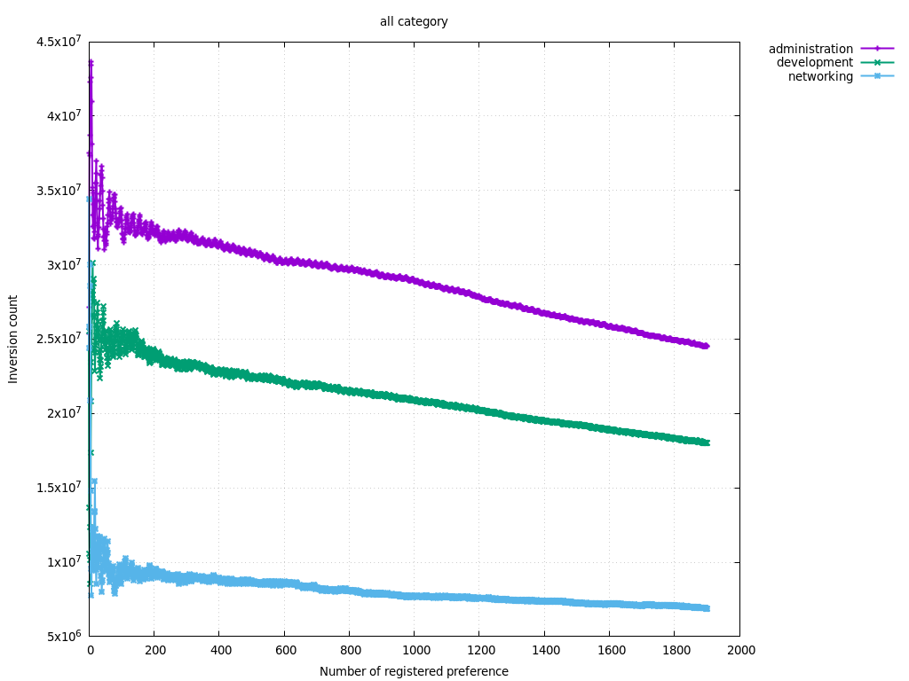
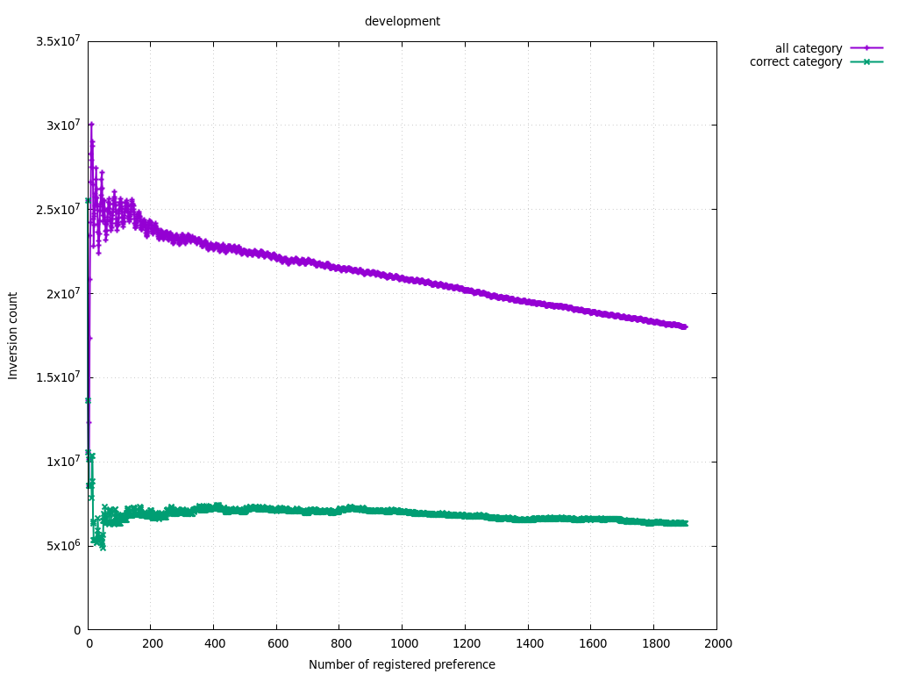
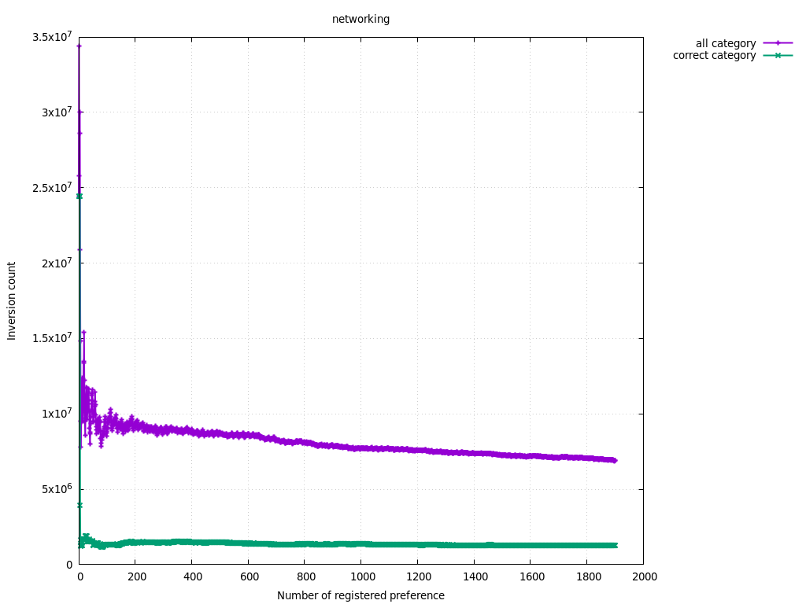
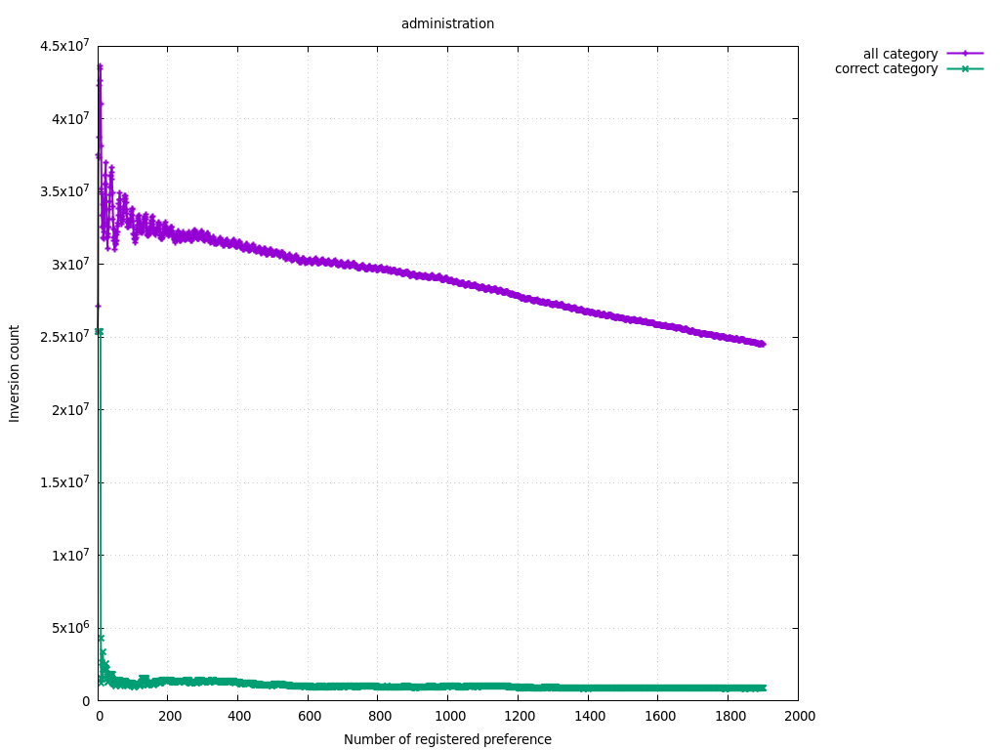
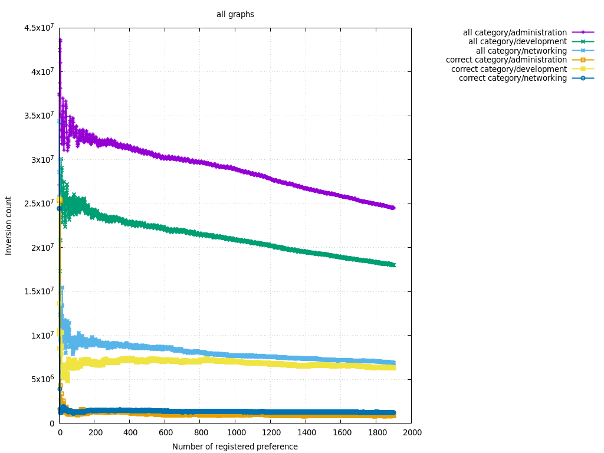

# recomendar — レコメンデーションシステムで質問を部署に振り分け

開発部、ネットワーク部、管理部、またはその複数の部署に質問を振り分けたい。
過去に各部署が回答した質問を positive 評価でレコメンデーションシステムに登録し、
各部署が回答すべき未回答の質問を抽出する。
部署ごとのレコメンドされた質問一覧は、当該部署が回答すべき質問が序盤に集中しており、
それ以外の部署が回答すべきと推論される質問は後半に集中するべきである。
これにより、最初から順番に回答し、関係ない質問が増えてきたら回答を終えることができる。
したがって、他部署の質問のあとに該当部署の質問があると、回答しそこねることがある。
よって、評価関数としては、転倒数を用いることとした。
また、比較として、すべての質問に positive 評価をしたレコメンデーションシステムの結果も提示する。

---

## 目次

1. 概要
2. 前提条件
3. セットアップ手順
4. 評価手順
   1. レコメンド評価の実行
   2. 出力ファイルと評価指標
5. 評価関数（転倒数）
6. プロット生成手順
7. ディレクトリ / コード構成
8. 参考: 使用データセット概要

---

## 1. 概要

`recomendar` は **Erlang / OTP** で実装された小規模なレコメンド評価フレームワークである。

* **Embeddings × ベクトル DB**: 外部ライブラリ [embe](https://github.com/ts-klassen/embe) を用いてベクトル DB qdrant を操作
* **評価観点**: 各質問が属する *部署* をレコメンドできるかを検証
* **評価関数**: レコメンデーション結果の順序誤りを *転倒数* で定量化

振り分け対象は 3 つの部署（`development` / `networking` / `administration`）である。
データセット中の質問（question）をベクトル化し、正しいカテゴリが
上位に出現するかを測定する。

---

## 2. 前提条件

| ツール | バージョン (推奨) | 用途 |
| ------ | ---------------- | ---- |
| Erlang/OTP | 24 以上 (目安) | ランタイム |
| rebar3    | 3.20 以上 (目安) | ビルド/依存管理 |
| gnuplot   | 5 系 | プロット生成 |
| curl / unzip | 任意の最新版 | データセット取得 (`compile.sh`) |


---

## 3. セットアップ手順

```bash
# 1) リポジトリ取得
git clone <this_repo_url>
cd recomendar

# 2) 依存解決 & コンパイル
rebar3 compile
```

`./compile.sh` `rebar3 compile` で実行され、
Kaggle で公開されている **MultiDeptQ** データセットを
ダウンロードし、`priv/` 配下に展開する。既に展開済みの場合はスキップされる。

---

## 4. 評価手順

### 4-1. レコメンド評価の実行

以下の方法で測定データを作成できる。

```bash
rebar3 shell
> recomendar:main([]).
```

処理完了後、`priv/` に測定結果 (`.dat`) が生成される。

### 4-2. 出力ファイルと評価指標

```
priv/
 ├─ all_category/       # 全カテゴリを学習させた場合
 │   ├─ development.dat
 │   ├─ networking.dat
 │   └─ administration.dat
 ├─ correct_category/   # 正しいカテゴリのみ学習させた場合
 │   └─ ... (同上)
 └─ id_list.json        # データセット中アイテムの ID 一覧
```

各 `.dat` は **TSV (タブ区切り)** で下記 2 列を保持する。

| 列 | 意味 |
| --- | ---- |
| 1 | 回答済み件数 (X 軸) |
| 2 | 転倒数 (Y 軸) |

**転倒数** はレコメンデーション順位の誤順序ペア数を示し、値が小さいほど
レコメンド精度が高いことを示す。

---

## 5. 評価関数（転倒数）

転倒数は、推薦リストにおける**誤った順序ペア**の総数を示す。

形式的には、長さ \(n\) の列 \(r = (r_1, r_2, \dots, r_n)\) に対し、
正例集合を \(P\)、負例集合を \(N\) としたとき

\[
\mathrm{IC}(r) = \bigl\lvert\{(i,j) \mid 1 \le i < j \le n,\; r_i \in N,\; r_j \in P\}\bigr\rvert
\]

となる。値が 0 であれば完全に正しい順序、値が大きいほど誤順位が多いことを意味する。

---

## 6. プロット生成手順

可視化には `plot.sh`（単発）または `generate_plots.sh`（一括）を利用する。

```bash
# すべてのグラフを生成
./generate_plots.sh     # plots/*.png が作成される

# 特定ディレクトリ(例: all_category) を描画
./plot.sh all_category  # priv/all_category.png

# 全 .dat を重ねて描画
./plot.sh --all         # priv/all_graphs.png
```

生成された画像はリポジトリの `plots/` 直下にも同梱してある。

### プロット一覧

下記に評価結果の全プロットを示す（クリックで拡大）。

| 画像 | 説明 |
| ---- | ---- |
|  | 全カテゴリ学習時、カテゴリ別 転倒数 |
|  | 正答カテゴリのみ学習時、カテゴリ別 転倒数 |
|  | `development` ← ディレクトリ横断で比較 |
|  | `networking` ← 同上 |
|  | `administration` ← 同上 |
|  | 全 `.dat` を 1 枚に集約 |

`plots/` フォルダは本リポジトリに含まれており、評価時点の結果を共有する。

---

## 7. ディレクトリ / コード構成

```
recomendar/
 ├─ src/                # Erlang ソース
 │   └─ recomendar.erl  # メイン: 評価ルーチン
 ├─ priv/               # データセット & 評価結果
 │   ├─ embeddings.json # 元データ (Vector + Metadata)
 │   └─ ...
 ├─ plots/              # 生成済みプロット (PNG)
 ├─ compile.sh          # データセット DL & 展開
 ├─ plot.sh             # gnuplot ラッパー (単発描画)
 ├─ generate_plots.sh   # プロット一括生成
 └─ rebar.config        # 依存管理 (embe など)
```

`src/recomendar.erl` の主な処理フロー:

1. データセット読み込み (`priv/embeddings.json`)
2. `embe` によるベクトル DB 構築
3. カテゴリごとに「好み」を登録し、レコメンデーションを取得
4. レコメンデーションを評価 (転倒数を算出)
5. 結果を TSV で出力

---

## 8. 参考: 使用データセット概要

評価には [MultiDeptQ Dataset](https://www.kaggle.com/datasets/tiagosimonklassen/multideptq)（Kaggle ID: `tiagosimonklassen/multideptq`）を使用している。

データセットには問い合わせ文、カテゴリ配列、埋め込みベクトルが含まれている。

| 項目 | 値 |
| ---- | --- |
| 総サンプル数 | 14541 |
| ベクトル次元 | 3072 |

#### カテゴリ別内訳（重複計上）

| カテゴリ | 件数 |
| -------- | ---- |
| administration | 5916 |
| development    | 6644 |
| networking     | 6180 |

1 行が複数カテゴリに属する場合があるため、上表の合計値は総サンプル数を上回る。

本リポジトリはデータを *vector + metadata* 形式（`embeddings.json`）で保持しており、
外部ネットワークへ接続せずに再現可能である。

